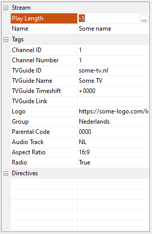
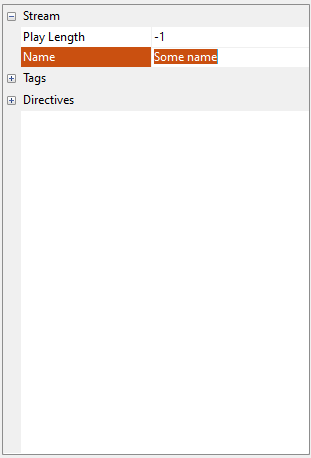
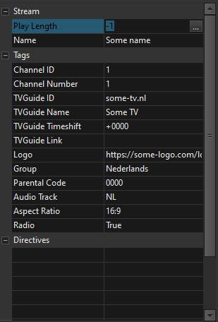
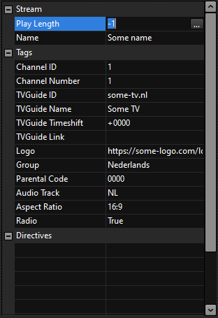

# Delphi-Inspector
Custom component for Delphi, Inspector like component with categories (collapsable) and inline editor.
This is a very simple component, and is all i needed - use it as you like, if you extend it please share the changes so i can update the component.

