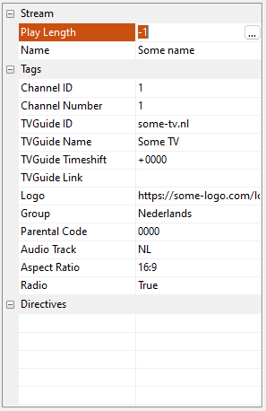
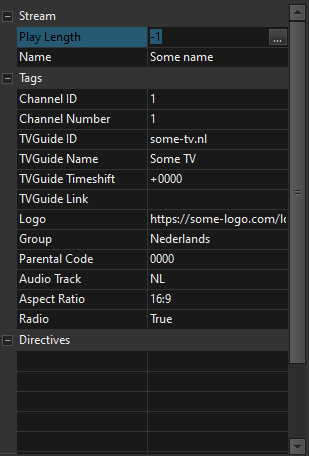

# Delphi Inspector

Delphi Inspector is a compact property-grid style component for Delphi VCL applications. It displays application-defined properties in collapsible categories and supports inline value editing, optional edit buttons, keyboard navigation, VCL Styles, and high-DPI layouts.

The component consists of a single source unit and has no dependencies beyond the Delphi RTL and VCL.




## Features

- Collapsible property categories
- Text, number, Boolean, drop-down, and date editors for `Variant`-backed values
- Optional ellipsis buttons for dialogs, pickers, and custom actions
- Adjustable name/value splitter
- Mouse, keyboard, and mouse-wheel navigation
- Typed access to the selected property or category
- Buffered custom painting
- VCL Styles support
- DPI-aware dimensions and editor placement
- Design-time collection editing
- Self-contained `Inspector.pas` unit

## Requirements

- Delphi 10.3 Rio or newer
- VCL application targeting Windows

No third-party libraries or runtime packages are required.

## Installation

### Add the unit directly to a project

1. Copy `Inspector.pas` into your project directory or a shared source directory.
2. Add the directory to the project's Delphi search path.
3. Add `Inspector` to the relevant unit's `uses` clause.
4. Create `TInspector` in code, or add the unit to a design-time package to install it on the component palette.

The included `Register` procedure registers `TInspector` on the **ERDesigns** palette page.

## Basic usage

```pascal
uses
  Inspector;

procedure TMainForm.PopulateInspector;
var
  Category: TInspectorCategory;
  Item: TInspectorProperty;
begin
  Inspector1.BeginUpdate;
  try
    Inspector1.Clear;

    Category := Inspector1.Categories.Add;
    Category.Caption := 'General';

    Item := Category.Properties.Add;
    Item.Name := 'Caption';
    Item.Value := 'Example';

    Item := Category.Properties.Add;
    Item.Name := 'Enabled';
    Item.Value := True;
    Item.EditorKind := iekBoolean;

    Item := Category.Properties.Add;
    Item.Name := 'Alignment';
    Item.Value := 'Left';
    Item.EditorKind := iekDropDown;
    Item.DropDownItems.Add('Left');
    Item.DropDownItems.Add('Center');
    Item.DropDownItems.Add('Right');

    Item := Category.Properties.Add;
    Item.Name := 'Color';
    Item.Value := 'clWindow';
    Item.EditButton := True;
  finally
    Inspector1.EndUpdate;
  end;
end;
```

`Value` remains a `Variant`, allowing the application to associate common Delphi
value types with an inspector property. Each editor writes its natural value type;
the text editor writes a string, while number, Boolean, and date editors preserve
their corresponding value types. `Null` and `Empty` values are displayed as empty
text.

## Property editors

Set a property's `EditorKind` to select its inline editor:

| Editor kind | Behavior | Value written to `Value` |
| --- | --- | --- |
| `iekText` | Borderless text editor | `String` |
| `iekNumber` | Locale-aware decimal input | `Double` |
| `iekInteger` | Bounded integer input with spin buttons | `Int64` |
| `iekBoolean` | Check box | `Boolean` |
| `iekDropDown` | Fixed choice from `DropDownItems` | `String` |
| `iekEnum` | Named single choice from `DropDownItems` | `String` |
| `iekFlags` | Modal multi-choice checklist | Comma-separated `String` |
| `iekDate` | Native date picker | `TDateTime` |
| `iekTime` | Native time picker | `TDateTime` |
| `iekDateTime` | Combined date/time picker | `TDateTime` |
| `iekColor` | Text value with `TColorDialog` | `TColor`/Integer |
| `iekFile` | Open-file dialog | File name `String` |
| `iekSaveFile` | Save-file dialog | File name `String` |
| `iekFolder` | Folder selector | Directory `String` |
| `iekMultiline` | Modal memo editor | `String` |
| `iekPassword` | Password-character text editor | `String` |
| `iekFont` | `TFontDialog` | Font summary `String` |
| `iekReadOnly` | Painted value without an inline control | Existing Variant type |
| `iekSlider` | Bounded track bar | `Integer` |
| `iekHotKey` | Native hot-key control | Hot-key `Integer` |
| `iekImage` | Image preview with image-file dialog | File name `String` |
| `iekMask` | Masked text input using `EditMask` | `String` |
| `iekCustom` | Application-supplied button editor | Application-defined |

`EditButton` remains independent of `EditorKind`. Set it to `True` to place an
ellipsis button beside any editor and handle the action through
`OnPropertyButtonClick`.

Editor-specific settings are kept on `TInspectorProperty`: `Minimum`, `Maximum`,
`Increment`, `EditMask`, `DialogFilter`, `PasswordChar`, and `DropDownItems`.
Dialog-based editors provide their standard VCL dialog automatically and still raise
`OnPropertyButtonClick` afterwards for application-specific processing.
`iekCustom` always shows an ellipsis button and delegates editing completely to
`OnPropertyButtonClick`.

## Handling events

```pascal
procedure TMainForm.InspectorPropertyChange(
  const AProperty: TInspectorProperty);
begin
  if AProperty.Name = 'Enabled' then
    MyObject.Enabled := StrToBoolDef(VarToStr(AProperty.Value), False);
end;

procedure TMainForm.InspectorPropertyButtonClick(
  const AProperty: TInspectorProperty);
begin
  if AProperty.Name = 'Color' then
  begin
    // Open an application-specific color picker here.
    AProperty.Value := 'clHighlight';
  end;
end;
```

Available component events include:

| Event | Raised when |
| --- | --- |
| `OnPropertySelect` | A property becomes selected |
| `OnPropertyChange` | Inline editor text changes |
| `OnPropertyChanged` | An inline edit session loses focus |
| `OnPropertyButtonClick` | A property's ellipsis button is clicked |
| `OnCategorySelect` | A category becomes selected |
| `OnCategoryCollapse` | A category is collapsed with the mouse |
| `OnCategoryExpand` | A category is expanded with the mouse |

The standard VCL click, focus, keyboard, and mouse events are also published.

## Selection and navigation

Use `Selected` to select either a `TInspectorProperty` or a `TInspectorCategory`. The typed `SelectedProperty` and `SelectedCategory` properties avoid manual type checks:

```pascal
Inspector1.Selected := Item;
Inspector1.EnsureSelectedVisible;

if Assigned(Inspector1.SelectedProperty) then
  Caption := Inspector1.SelectedProperty.Name;
```

`ExpandAll` and `CollapseAll` update all categories in a single buffered operation.

Keyboard support includes:

- **Up/Down** to move through categories and visible properties
- **Left/Right** to collapse or expand the selected category
- **Home/End** to move to the first or last visible item
- **Page Up/Page Down** to scroll by a page
- **Enter** to finish inline editing
- **Escape** to close the editor and clear the selection
- **Ctrl+Mouse wheel** to change the selection

## Appearance and styling

The main appearance groups are:

- `CategoryOptions` — category height, color, font, and focus rectangle
- `PropertyOptions` — property row height and font
- `GutterOptions` — collapse-glyph gutter width and color
- `Splitter` — splitter position, color, and cursor

The Inspector also publishes standard VCL properties such as `Color`, `Font`, `Constraints`, `PopupMenu`, `ShowHint`, and `Visible`.

VCL Styles are resolved through the VCL style services. Styles linked into the host application can be selected normally through `TStyleManager`; the component requires no style-specific setup.

Dimensions are stored as logical 96-DPI values and scaled using the control's current PPI. Category rows, property rows, gutter, splitter, inline editor, edit button, and drawing offsets therefore retain their intended proportions on high-DPI displays.

## Example application

[`examples/InspectorDemo`](examples/InspectorDemo) contains a minimal VCL form application demonstrating:

- All built-in text, numeric, choice, date/time, dialog, slider, hot-key, image, and mask editors
- An edit-button property
- An initially collapsed category
- Selection and change events
- Category collapse and expand events
- Runtime VCL Style selection

Open `examples/InspectorDemo/InspectorDemo.dpr` in Delphi to inspect the form in the Form Designer, then build and run it.

## Screenshots

Additional screenshots are available in the repository:

- [Windows theme — screenshot 1](Screenshot-1.png)
- [Windows theme — screenshot 2](Screenshot-2.png)
- [VCL Style — screenshot 3](Screenshot-3.png)
- [VCL Style — screenshot 4](Screenshot-4.png)

## License

Delphi Inspector is available under the [MIT License](LICENSE).

Copyright © 2023–2026 ERDesigns - Ernst Reidinga
